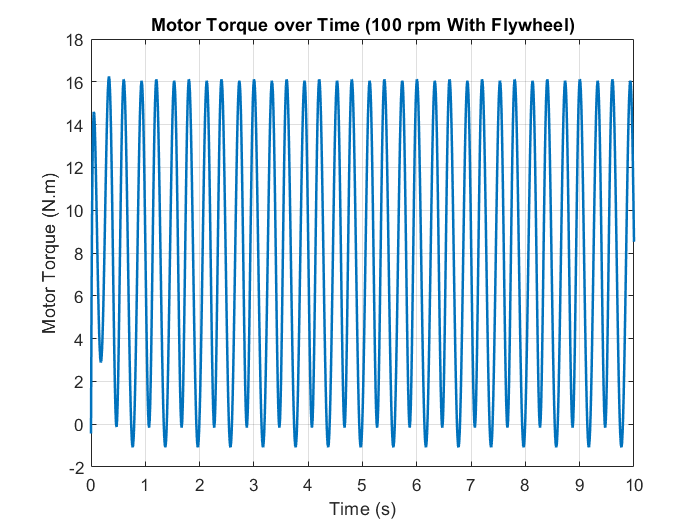
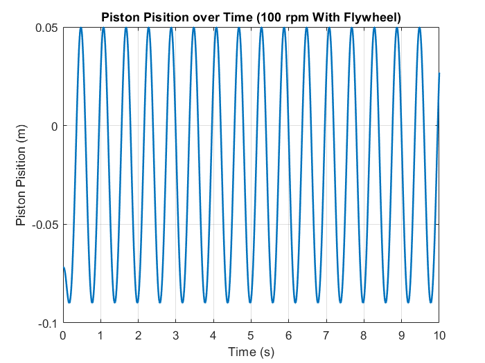
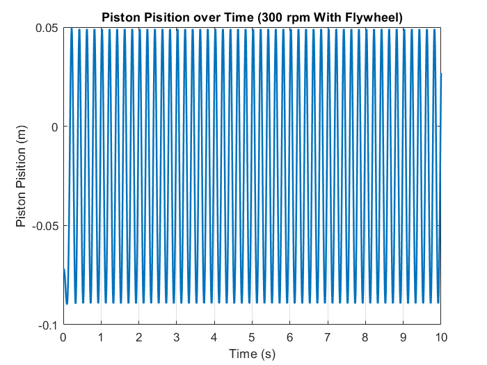
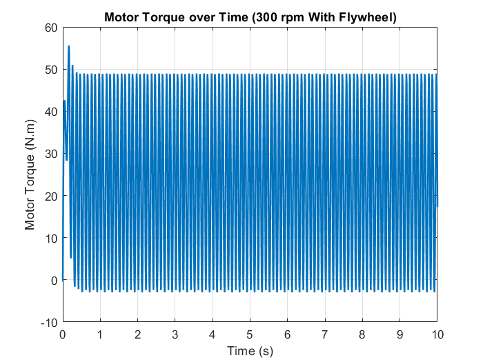
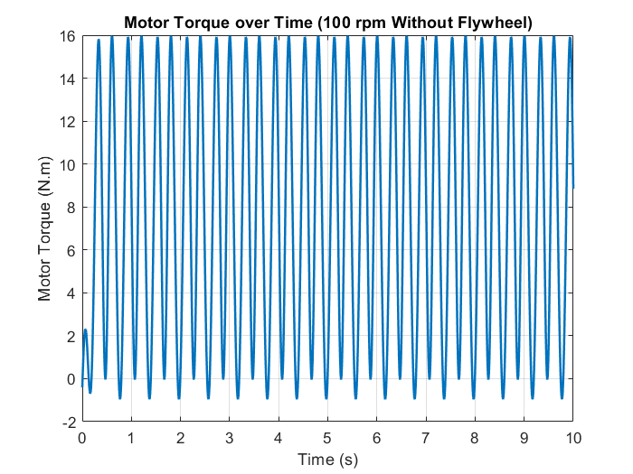

# Reciprocating Pump Dynamics

Dynamic simulation and analysis of a reciprocating pump mechanism using MATLAB/Simulink and Simscape Multibody.

The model simulates the conversion of rotary motion into reciprocating piston motion and investigates the dynamic behavior of the mechanism at motor speeds of 100 rpm and 300 rpm. The effect of a flywheel on the required motor torque is also evaluated by comparing simulations with and without the flywheel.

  

## Project Objectives

* Model a reciprocating pump mechanism using Simscape Multibody
* Simulate the mechanism at 100 rpm and 300 rpm
* Analyze motor torque, piston position, and cylinder angle
* Compare the dynamic response at different operating speeds
* Investigate the effect of a flywheel on the required motor torque
* Compare the maximum motor torque with and without the flywheel

## Simulation Conditions

| Parameter              |                             Value |
| ---------------------- | --------------------------------: |
| Simulation duration    |                              10 s |
| Motor speeds           |               100 rpm and 300 rpm |
| Simulation environment |                 MATLAB / Simulink |
| Multibody modeling     |                Simscape Multibody |
| Mechanism type         | Slider-Crank / Reciprocating Pump |

The simulation monitors the following quantities:

* Motor torque
* Piston position
* Cylinder angle

The mechanism exhibits periodic motion due to the rotary-to-reciprocating motion conversion. Increasing the motor speed increases the frequency of the response while the overall displacement range remains primarily determined by the mechanism geometry.

## Dynamic Response at 100 rpm

At 100 rpm, the mechanism completes approximately:

$$
\frac{100}{60} \approx 1.67 \text{ cycles/s}
$$

The piston position therefore repeats approximately every:

$$
T \approx 0.6 \text{ s}
$$

The simulated piston position varies approximately from -0.09 m to +0.05 m, corresponding to a stroke of about:

$$
S \approx 0.14\text{ m}
$$

The motor torque shows periodic oscillations caused by the changing inertial and resistive loads throughout the reciprocating cycle.

  

  

## Dynamic Response at 300 rpm

At 300 rpm, the rotational speed is three times higher than at 100 rpm:

$$
\frac{300}{60}=5\text{ cycles/s}
$$

Consequently, the piston motion and torque oscillations occur at approximately three times the frequency observed at 100 rpm.

The piston displacement range remains approximately unchanged because it is mainly determined by the geometry of the mechanism, while the higher rotational speed produces significantly faster motion and larger dynamic effects.

  

  

## Effect of the Flywheel

The effect of the flywheel was investigated by performing two separate simulations:

1. Without a flywheel
2. With a flywheel

The maximum motor torque was obtained from the corresponding torque-time plots.

| Configuration    | Maximum Motor Torque |
| ---------------- | -------------------: |
| Without flywheel |           16.257 N·m |
| With flywheel    |           15.960 N·m |

The results show a small reduction in the maximum motor torque when the flywheel is included.

The flywheel stores kinetic energy during portions of the cycle when the required torque is lower and releases energy when the mechanism requires additional torque. This helps smooth the torque demand and reduces the peak torque required from the motor.

  

  

## Key Results

| Operating Condition | Main Observation                                                     |
| ------------------- | -------------------------------------------------------------------- |
| 100 rpm             | Periodic piston and torque response with approximately 1.67 cycles/s |
| 300 rpm             | Response frequency increases to approximately 5 cycles/s             |
| Piston motion       | Displacement range is mainly determined by mechanism geometry        |
| Flywheel            | Slight reduction in maximum motor torque                             |
| Without flywheel    | Larger direct transmission of dynamic torque variations to the motor |
| With flywheel       | Smoother torque response and energy exchange during the cycle        |

Increasing the motor speed from 100 rpm to 300 rpm increases the frequency of the reciprocating motion by a factor of three. The piston displacement range remains approximately similar, while the dynamic loading of the mechanism becomes more significant at the higher operating speed.

## Results

The [`Diagrams`](Diagrams/) directory contains the simulation results:

* Motor torque at 100 rpm
* Motor torque at 100 rpm without flywheel
* Motor torque at 300 rpm
* Piston position at 100 rpm
* Piston position at 100 rpm without flywheel
* Piston position at 300 rpm
* Cylinder angle at 100 rpm
* Cylinder angle at 100 rpm without flywheel
* Cylinder angle at 300 rpm

## Repository Contents

* [`SimulationWithFlywheel.slx`](model/SimulationWithFlywheel.slx) — Simscape Multibody model including the flywheel
* [`SimulationWithoutFlywheel.slx`](model/SimulationWithoutFlywheel.slx) — Simscape Multibody model without the flywheel
* [`Diagrams/`](Diagrams/) — Simulation plots and comparison figures
* [`PersianReport.pdf`](docs/reciprocating-pump-dynamics-fa.pdf)
* [`EnglishReport.pdf`](docs/Reciprocating_Pump_Dynamics_English.pdf)

## Requirements

* MATLAB
* Simulink
* Simscape Multibody

## Course

**Machine Dynamics — Sharif University of Technology**

**Instructor:** Dr. Sayadi

## Author

**Mohammadreza Sotoudeh**

B.Sc. Student in Mechanical Engineering
Sharif University of Technology
